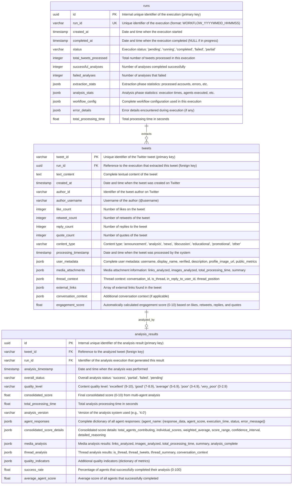

# ER Diagram - PostgreSQL Database (Simplified)

This document contains the Entity-Relationship (ER) diagram in Mermaid format for the Twitter news classification system, designed for a future PostgreSQL implementation.

**Simplified version**: Focused on essential tables to store program results.

## ER Diagram

## Field Documentation

### Table: `runs`

Stores complete workflow executions (extraction and analysis combined).

| Field | Type | Description |
|-------|------|-------------|
| `id` | UUID | Internal unique identifier of the execution (primary key) |
| `run_id` | VARCHAR(100) | Unique identifier of the execution (format: WORKFLOW_YYYYMMDD_HHMMSS) |
| `created_at` | TIMESTAMP | Date and time when the execution started |
| `completed_at` | TIMESTAMP | Date and time when the execution completed (NULL if in progress) |
| `status` | ENUM | Execution status: 'pending', 'running', 'completed', 'failed', 'partial' |
| `total_tweets_processed` | INTEGER | Total number of tweets processed in this execution |
| `successful_analyses` | INTEGER | Number of analyses completed successfully |
| `failed_analyses` | INTEGER | Number of analyses that failed |
| `extraction_stats` | JSONB | Extraction phase statistics: processed accounts, errors, etc. |
| `analysis_stats` | JSONB | Analysis phase statistics: execution times, agents executed, etc. |
| `workflow_config` | JSONB | Complete workflow configuration used in this execution |
| `error_details` | JSONB | Error details encountered during execution (if any) |
| `total_processing_time` | FLOAT | Total processing time in seconds |

### Table: `tweets`

Stores extracted tweets with all metadata embedded as JSONB.

| Field | Type | Description |
|-------|------|-------------|
| `tweet_id` | VARCHAR(50) | Unique identifier of the Twitter tweet (primary key) |
| `run_id` | UUID | Reference to the execution that extracted this tweet (foreign key) |
| `text_content` | TEXT | Complete textual content of the tweet |
| `created_at` | TIMESTAMP | Date and time when the tweet was created on Twitter |
| `author_id` | VARCHAR(50) | Identifier of the tweet author on Twitter |
| `author_username` | VARCHAR(100) | Username of the author (@username) |
| `like_count` | INTEGER | Number of likes on the tweet |
| `retweet_count` | INTEGER | Number of retweets of the tweet |
| `reply_count` | INTEGER | Number of replies to the tweet |
| `quote_count` | INTEGER | Number of quotes of the tweet |
| `content_type` | ENUM | Content type: 'announcement', 'analysis', 'news', 'discussion', 'educational', 'promotional', 'other' |
| `processing_timestamp` | TIMESTAMP | Date and time when the tweet was processed by the system |
| `user_metadata` | JSONB | Complete user metadata: username, display_name, verified, description, profile_image_url, public_metrics (followers_count, following_count, tweet_count) |
| `media_attachments` | JSONB | Media attachment information: links_analyzed (array), images_analyzed (array), total_processing_time, summary |
| `thread_context` | JSONB | Thread context: conversation_id, is_thread (boolean), in_reply_to_user_id, thread_position |
| `external_links` | JSONB | Array of external links found in the tweet |
| `conversation_context` | JSONB | Additional conversation context (if applicable) |
| `engagement_score` | FLOAT | Automatically calculated engagement score (0-10) based on likes, retweets, replies, and quotes |

### Table: `analysis_results`

Stores complete multi-agent analysis results with all data embedded as JSONB.

| Field | Type | Description |
|-------|------|-------------|
| `id` | UUID | Internal unique identifier of the analysis result (primary key) |
| `tweet_id` | VARCHAR(50) | Reference to the analyzed tweet (foreign key) |
| `run_id` | VARCHAR(100) | Identifier of the analysis execution that generated this result |
| `analysis_timestamp` | TIMESTAMP | Date and time when the analysis was performed |
| `overall_status` | ENUM | Overall analysis status: 'success', 'partial', 'failed', 'pending' |
| `quality_level` | ENUM | Content quality level: 'excellent' (9-10), 'good' (7-8.9), 'average' (5-6.9), 'poor' (3-4.9), 'very_poor' (0-2.9) |
| `consolidated_score` | FLOAT | Final consolidated score (0-10) from multi-agent analysis |
| `total_processing_time` | FLOAT | Total analysis processing time in seconds |
| `analysis_version` | VARCHAR(20) | Version of the analysis system used (e.g., '4.0') |
| `agent_responses` | JSONB | Complete dictionary of all agent responses: {agent_name: {response_data, agent_score, execution_time, status, error_message}} |
| `consolidated_score_details` | JSONB | Consolidated score details: total_agents_contributing, individual_scores (dict), weighted_average, score_range, confidence_interval, detailed_reasoning |
| `media_analysis` | JSONB | Media analysis results: links_analyzed, images_analyzed, total_processing_time, summary, analysis_complete |
| `thread_analysis` | JSONB | Thread analysis results: is_thread, thread_tweets (array), thread_summary, conversation_context |
| `quality_indicators` | JSONB | Additional quality indicators (dictionary of metrics) |
| `success_rate` | FLOAT | Percentage of agents that successfully completed their analysis (0-100) |
| `average_agent_score` | FLOAT | Average score of all agents that successfully completed |

## Relationships

- **runs → tweets**: One-to-many relationship. One execution can extract multiple tweets.
- **tweets → analysis_results**: One-to-one relationship. Each tweet can have one analysis result.

## Design Notes

This simplified model uses only **3 main tables** focused on storing program results:

- **`runs`**: Tracks complete executions (combines workflow_runs, extraction_runs, analysis_runs)
- **`tweets`**: Tweet data with metadata embedded as JSONB
- **`analysis_results`**: Analysis results with all data embedded as JSONB

**Key Design Decisions:**

1. **Extensive use of JSONB**: Complex structures are stored directly in main tables as JSONB fields, reducing the need for multiple tables and JOINs.

2. **Simplified schema**: By embedding related data (user metadata, media attachments, agent responses, etc.) as JSONB, the schema is easier to maintain and query.

3. **Focus on results**: The design prioritizes storing complete analysis results over normalized data structures, making it ideal for result storage and retrieval.
